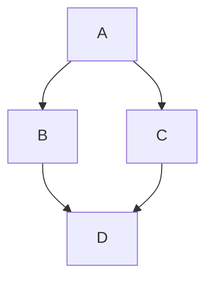

<button class="btn js-toggle-dark-mode">Preview dark color scheme</button>

<script>
const toggleDarkMode = document.querySelector('.js-toggle-dark-mode');

jtd.addEvent(toggleDarkMode, 'click', function(){
  if (jtd.getTheme() === 'dark') {
    jtd.setTheme('light');
    toggleDarkMode.textContent = 'Preview dark color scheme';
  } else {
    jtd.setTheme('dark');
    toggleDarkMode.textContent = 'Return to the light side';
  }
});
</script>

文本可以是**粗体**、_斜体_ 或~~删除线~~。

[链接到另一个页面]({{site.baseurl}}/)。

段落之间应该有空格。

段落之间应该有空格。我们建议包含 README 或包含有关恁的项目的信息的文件。

# 标题 1

这是标题后面的普通段落。GitHub 是一个用于版本控制和协作的代码托管平台。它允许恁和其他人从任何地方共同完成项目。

## 标题 2

> 这是标题后面的块引用。
>
> 当某件事足够重要时，即使胜算不大，恁也会去做。

### 标题 3

```js
// Javascript code with syntax highlighting.
var fun = function lang(l) {
  dateformat.i18n = require('./lang/' + l)
  return true;
}
```

```ruby
# Ruby code with syntax highlighting
GitHubPages::Dependencies.gems.each do |gem, version|
  s.add_dependency(gem, "= #{version}")
end
```

#### 标题 4 `代码未转换`

* 这是一个标题后面的无序列表。
* 这是一个标题后面的无序列表。
* 这是一个标题后面的无序列表。

##### 标题 5

1. 这是一个标题后面的有序列表。
2. 这是一个标题后面的有序列表。
3. 这是一个标题后面的有序列表。

###### 标题 6

[这是一个非常长的链接，它会换行，因此即使它位于行首](.) 也不会溢出。

- [这是一个非常长的链接，它会换行，因此在列表中第一个项目 ](.) 中使用时不会溢出行。

| head1        | head two          | three |
|:-------------|:------------------|:------|
| ok           | good swedish fish | nice  |
| out of stock | good and plenty   | nice  |
| ok           | good `oreos`      | hmm   |
| ok           | good `zoute` drop | yumm  |

### 下方有一条水平线。

* * *

### 这是一个无序列表: 

* 项目 foo
* 项目 bar
* 项目 baz
* 项目 zip

### 有序列表: 

1. 项目一
1. 项目二
1. 项目三
1. 项目四

### 有序列表，继续: 

1. 项目一
1. 项目二

一些文本

{:style="counter-reset:none"}
1. 项目三
1. 项目四

### 有序列表从 42 开始: 

{:style="counter-reset:step-counter 41"}
1. 项目 42
1. 项目 43
1. 项目 44

### 嵌套列表: 
- level 1 item
  - level 2 item
  - level 2 item
    - level 3 item
    - level 3 item
- level 1 item
  - level 2 item
  - level 2 item
  - level 2 item
- level 1 item
  - level 2 item
  - level 2 item
- level 1 item

### 将 ol 嵌套在 ul 中

- level 1 item (ul)
  1. level 2 item (ol)
  1. level 2 item (ol)
    - level 3 item (ul)
    - level 3 item (ul)
- level 1 item (ul)
  1. level 2 item (ol)
  1. level 2 item (ol)
    - level 3 item (ul)
    - level 3 item (ul)
  1. level 4 item (ol)
  1. level 4 item (ol)
    - level 3 item (ul)
    - level 3 item (ul)
- level 1 item (ul)
### 任务列表

- [ ] 恁好，这是一个待办事项
- [ ] 恁好，这是另一个待办事项
- [x] 再见，这个事项已完成

### 嵌套任务列表

- [ ] 一级项目（任务）
  - [ ] 二级项目（任务）
  - [ ] 二级项目（任务）
- [ ] 一级项目（任务）
- [ ] 一级项目（任务）

### 在任务列表中嵌套无序列表

- [ ] 一级项目（任务）
  - 二级项目（无序列表）
  - 二级项目（无序列表）
- [ ] 一级项目（任务）
- [ ] 一级项目（任务）

### 在无序列表中嵌套任务列表

- 一级项目（无序列表）
  - [ ] 二级项目（任务）
  - [ ] 二级项目（任务）
- 一级项目（无序列表）
- 一级项目（无序列表）

### 小图片

<!--  -->


### 大图片

<!--  -->

"[弗罗茨瓦夫大学图书馆数字化稀有档案文本](https://www.flickr.com/photos/97810305@N08/9401451269)" by [j_cadmus](https://www.flickr.com/photos/97810305@N08) is marked with [CC BY 2.0](https://creativecommons.org/licenses/by/2.0/?ref=openverse).

### 标签

我是一个标签
{: .label }

蓝色
{: .label .label-blue }
绿色
{: .label .label-green }
紫色
{: .label .label-purple }
黄色
{: .label .label-yellow }
红色
{: .label .label-red }

**粗体**
{: .label }
*斜体*
{: .label }
***粗体 + 斜体***
{: .label }

### 定义列表可以使用 HTML 语法。

<dl>
<dt>名字</dt>
<dd>哥斯拉</dd>
<dt>出生</dt>
<dd>1952</dd>
<dt>出生地</dt>
<dd>日本</dd>
<dt>颜色</dt>
<dd>绿色</dd>
</dl>

#### 多个描述术语和值

术语
: 术语的简短描述

较长的术语
: 较长的术语描述，
  可能不止一行

术语
: 术语的第一个描述，
  可能不止一行

: 术语的第二个描述，
  可能不止一行

术语1
术语2
: 术语1和术语2的单一描述，
  可能不止一行

术语1
术语2
: 术语1和术语2的第一个描述，
  可能不止一行

: 术语1和术语2的第二个描述，
  可能不止一行

### 更多代码

```python
def dump_args(func):
    "This decorator dumps out the arguments passed to a function before calling it"
    argnames = func.func_code.co_varnames[:func.func_code.co_argcount]
    fname = func.func_name
    def echo_func(*args,**kwargs):
        print fname, ":", ', '.join(
            '%s=%r' % entry
            for entry in zip(argnames,args) + kwargs.items())
        return func(*args, **kwargs)
    return echo_func

@dump_args
def f1(a,b,c):
    print a + b + c

f1(1, 2, 3)

def precondition(precondition, use_conditions=DEFAULT_ON):
    return conditions(precondition, None, use_conditions)

def postcondition(postcondition, use_conditions=DEFAULT_ON):
    return conditions(None, postcondition, use_conditions)

class conditions(object):
    __slots__ = ('__precondition', '__postcondition')

    def __init__(self, pre, post, use_conditions=DEFAULT_ON):
        if not use_conditions:
            pre, post = None, None

        self.__precondition  = pre
        self.__postcondition = post
```

```
长的单行代码块不应换行。如果它们太长，则应水平滚动。这行代码应该足够长以演示这一点。
```

### Mermaid 图表

以下代码仅在 `_config.yml` 中提供 `mermaid` 键时显示为图表。



### 折叠部分

以下使用 [`<details>`](https://docs.github.com/en/get-started/writing-on-github/working-with-advanced-formatting/organizing-information-with-collapsed-sections) 标签创建一个折叠部分。

<details markdown="block">
<summary>购物清单（点击我！）</summary>

这是 `<details>` 下拉菜单中的内容。

- [ ] 苹果
- [ ] 橙子
- [ ] 牛奶

</details>
```
